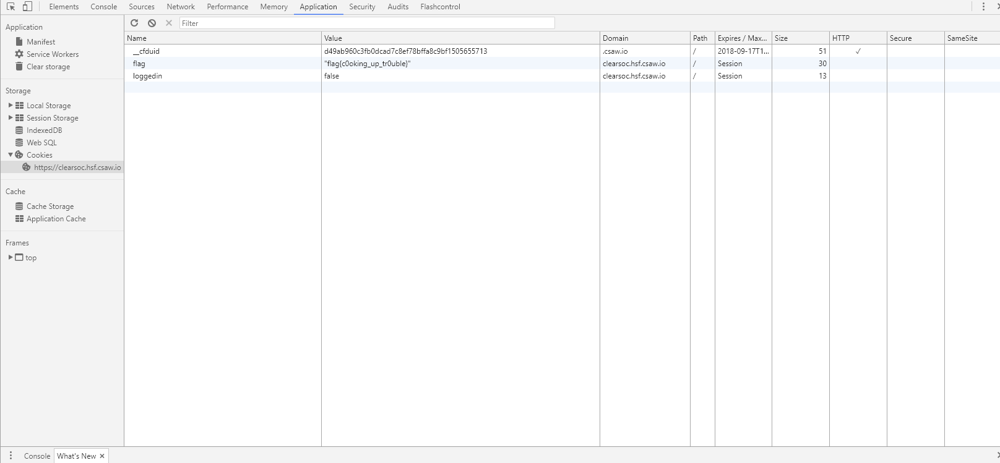

#Cookies

20 points
>As you found in his browser history, he's visited an interesting site. Can you find a way to log in to it?
## Solving it

After looking at the different areas of the site and not finding much of use, I decided to start looking in the [Chrome DevTools](https://developer.chrome.com/devtools). After a while I made my way to the `application` area in the top bar of the DevTools window.
And then it occurred to me that based on the name of the challenge `Cookies` it might be a [browser cookie](https://en.wikipedia.org/wiki/HTTP_cookie). So I to opted look at the sub-section `Cookies` and there I found two things of interest:

1. The flag: `"flag{c0oking_up_tr0uble}"`
2. And a vector into the Clearsoc Forums,
just change the `loggedin` cookie from `false` to `true`.
